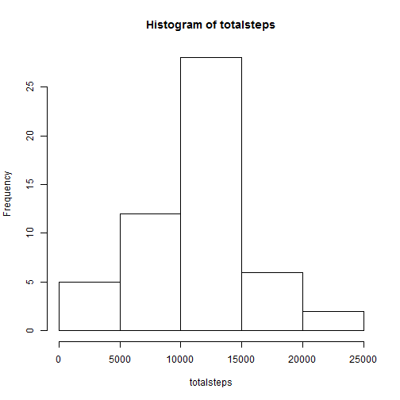
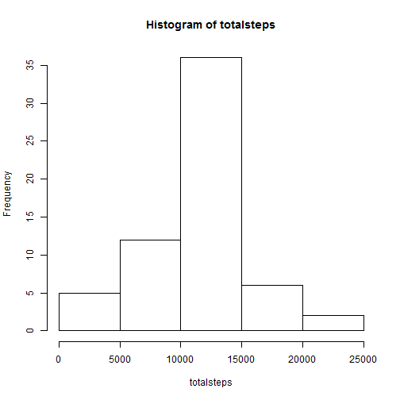
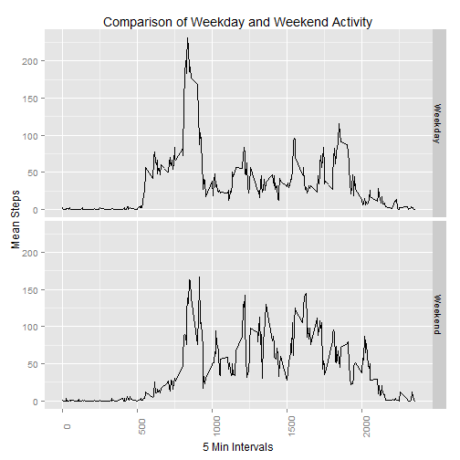

The following is an analysis of the steps taken from a personal activity monitor.

### Loading data


```r
library(dplyr)
library(ggplot2)
activity_df_dirty <- read.csv("activity.csv")
activity_df <- activity_df_dirty[!is.na(activity_df_dirty$steps),c("steps","date","interval")]
```

### Initial Analysis (ignores NAs)

```r
steps_by_day <- activity_df %>%
 group_by(date) %>%
 summarise(totalsteps = sum(steps))
```

Histogram of total number of steps taken each day:


```r
with(steps_by_day, hist(totalsteps))
```

 


```r
mean(steps_by_day$totalsteps)
```

```
## [1] 10766.19
```

```r
median(steps_by_day$totalsteps)
```

```
## [1] 10765
```

The following code calculates the mean number of steps for each of the intervals for
which data is available.

```r
average_by_interval <- activity_df %>%
                        group_by(interval) %>%
                        summarize(meansteps = mean(steps))
```

The plot below shows the mean value for each interval.

```r
with(average_by_interval,
    plot(interval, meansteps, type = 'l')
)
```

 

The following code calculates the maximal average interval then returns the interval that 
matches the maximum.

```r
max_interval <- max(average_by_interval$meansteps)
average_by_interval[average_by_interval$meansteps == max_interval,"interval"]
```

```
## Source: local data frame [1 x 1]
## 
##   interval
## 1      835
```

### Secondary Analysis (NAs filled)
We can see that there are a number of missing data points from the original set.

```r
length(activity_df_dirty[is.na(activity_df_dirty$steps),'steps'])
```

```
## [1] 2304
```

Here we fill the missing data for all NAs using the mean value for the missing intervals.
We then calculate updated averages using that information to show how the values move.

```r
activity_df_filled <- activity_df_dirty 
tmp <- inner_join(activity_df_filled, average_by_interval, by = c("interval" = "interval"))
activity_df_filled[is.na(activity_df_filled$steps),'steps'] <- 
              tmp[which(is.na(activity_df_filled$steps), arr.ind=TRUE),'meansteps']

# clean-up
remove(tmp)

steps_by_day_filled <- activity_df_filled %>%
 group_by(date) %>%
 summarise(totalsteps = sum(steps))
```

Histogram of total number of steps taken each day after filling NAs:


```r
with(steps_by_day_filled, hist(totalsteps))
```

 

From the histogram you can see the total number of steps has increased as a result of
the filling method employed. In addition, the values for mean and median have converged and 

```r
mean(steps_by_day_filled$totalsteps)
```

```
## [1] 10766.19
```

```r
median(steps_by_day_filled$totalsteps)
```

```
## [1] 10766.19
```

### Final Analysis (Comparison of Day Types)
In the final comparison below, we can see a substantial reduction in the maximal mean interval.

```r
daytype_df <- activity_df_filled
# add a new column with the day type
daytypetmp <- c("Monday" = "Weekday",
                "Tuesday" = "Weekday",
                "Wednesday" = "Weekday",
                "Thursday" = "Weekday",
                "Friday" = "Weekday",
                "Saturday" = "Weekend",
                "Sunday" = "Weekend")
daytype_df$daytype <- daytypetmp[weekdays(as.Date(as.character(daytype_df$date)
                                                  , format = "%Y-%m-%d" ))]
we_wd_avg <- daytype_df %>%
                            group_by(daytype,interval) %>%
                            summarize(meansteps = mean(steps))
ggplot(we_wd_avg, aes(x = interval, y = meansteps)) +
            geom_line(stat = "identity") +
            facet_grid(daytype ~ .) +
            ylab("Mean Steps") +
            xlab("5 Min Intervals") +
            theme(axis.text.x=element_text(angle=90)) +
            ggtitle("Comparison of Weekday and Weekend Activity")
```

 
